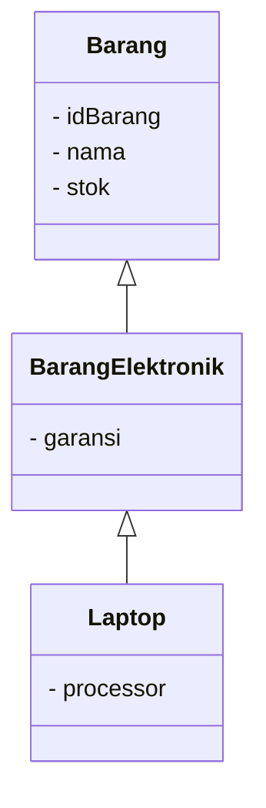

# LAPORAN UJIAN TENGAH SEMESTER (UTS) PEMROGRAMAN BERORIENTASI OBJEK
## SISTEM MANAJEMEN PENGADAAN  CV MANDIRI PRIMA KREATIF

--------------

Nama : Elena Dementieva

NIM : 2509116008

Kelas : Sistem Informasi A'25

--------------

## **BAB I PENDAHULUAN**

### **1.1 Deskripsi Program**

Sistem Manajemen CV Mandiri Prima Kreatif merupakan program berbasis java yang dibuat untuk membantu mengelola data pada CV Mandiri Prima Kreatif yang bergerak di bidang elektronik dan pengadaan barang.

Program ini digunakan untuk mengelola tiga jenis data, yaitu data barang, data pemasok, dan data pengadaan. Pengelolaan data dilakukan dengan menerapkan konsep CRUD (Create, Read, Update, Delete), sehingga user dapat menambahkan, menampilkan, memperbarui, dan menghapus data.

Program dibuat dengan menerapkan konsep Pemrograman Berorientasi Objek (PBO), seperti class, object, constructor, access modifier, encapsulation, ArrayList, percabangan, input, perulangan, dan validasi input.

Program terdiri dari satu class entry point yaitu SistemmanajemenCVMPK, class controller yaitu service, serta beberapa class model yaitu Barang, Barang elektronik, Barang non elektronik, Laptop, Pemasok, dan Pengadaan.

### **1.2 Tujuan**

Sistem Manajemen CV Mandiri Prima Kreatif dirancang dengan tujuan sebagai berikut:

- Membantu mengelola data barang, pemasok, dan pengadaan secara terstruktur.
- Memudahkan proses tambah, tampil, update, dan hapus data pada sistem.
- Menerapkan konsep pemrograman berorientasi objek seperti encapsulation, inheritance, dan polymorphism dalam program.
- Memastikan data yang dimasukkan sesuai melalui proses validasi input.

### **1.3 Alur Singkat**

Alur program dimulai dengan menampilkan menu utama sistem manajemen CV Mandiri Prima Kreatif dimana pengguna dapat memilih menu sesuai kebutuhan, seperti mengelola data barang, mengelola data pemasok, mengelola data pengadaan, ataupun keluar dari program.

Pada menu kelola data barang, pengguna dapat menambahkan data barang dengan memasukkan ID barang, nama barang, dan stok, selanjutnya pengguna kemudian dapat memilih jenis barang, yaitu Barang Elektronik atau Barang Non-Elektronik. Barang elektronik memiliki data tambahan berupa garansi, sedangkan barang non-elektronik memiliki data tambahan berupa kategori.

Pada menu kelola data pemasok, pengguna dapat menambahkan data pemasok dengan memasukkan ID pemasok, nama pemasok, alamat, dan nomor telepon. Data pemasok yang telah tersimpan dapat ditampilkan, diperbarui, maupun dihapus.

Pada menu kelola data pengadaan, pengguna dapat menambahkan data pengadaan dengan memasukkan ID pengadaan, tanggal pengadaan, dan alamat pengadaan. Data pengadaan yang telah tersimpan juga dapat ditampilkan, diperbarui, maupun dihapus.

Setiap proses input dilengkapi dengan validasi untuk memastikan data yang dimasukkan tidak kosong dan sesuai dengan tipe data yang ditentukan dan program ini akan terus menampilkan menu utama sampai pengguna memilih menu keluar.

--------------

## **BAB II ALUR PROGRAM**

Program dijalankan melalui class "SistemmanajemenCVMPK" yang berada pada package "view"

Saat program dijalankan, pengguna akan diberikan menu utama dari Sistem manajemen CV mandiri prima kreatif, yaitu;

Pengguna dapat memilih menu dengan memasukkan pilihan angka yang valid sesuai dengan kebutuhannya masing - masing.

### **2.1 Kelola Data Barang**

Pada menu kelola data barang, terdapat beberapa pilihan yang dapat dipilih oleh user yaitu;

-> **Tambah Data Barang**

Gambar di atas menunjukkan proses penambahan data barang pada program Sistem Manajemen Pengadaan CV MPK.

Pada proses ini, pengguna diminta mengisi beberapa data barang, yaitu:

1. ID Barang yang digunakan sebagai identitas unik barang.
2. Nama Barang yang digunakan untuk memasukkan nama barang.
3. Stok Barang yang digunakan untuk menentukan jumlah stok barang.
4. Jenis Barang yang digunakan pengguna untuk dapat memilih:

   - Barang Elektronik
   - Barang Non-Elektronik

5. Garansi yang digunakan untuk mengisi masa garansi pada barang elektronik.
6. Jenis Barang Elektronik yang digunakan khusus untuk barang elektronik, lalu pengguna dapat memilih:

   - Barang Elektronik
   - Laptop

7. Processor akan muncul ketika pengguna memilih jenis Laptop.

Pada contoh gambar diatas, pengguna memasukkan barang dengan "ID 3", nama "Acer Aspire 7 Pro Gaming", stok "5", dan memilih jenis "Barang Elektronik". Selanjutnya pengguna memilih jenis "Laptop", kemudian memasukkan processor "Ryzen 9".

Proses tersebut menunjukkan penerapan "inheritance multilevel", yaitu objek "Laptop" merupakan turunan dari "BarangElektronik", sedangkan "BarangElektronik" merupakan turunan dari "Barang". Dengan demikian, "Laptop" dapat mewarisi atribut dan method dari class di atasnya sekaligus memiliki atribut khusus seperti "processor".

Setelah seluruh data berhasil dimasukkan, program menampilkan pesan "Barang baru berhasil ditambahkan!" sebagai tanda bahwa data telah berhasil disimpan ke dalam "ArrayList".

-> **Tampilkan Barang**

Lalu data barang terbagi ke dalam dua jenis yaitu;

- Barang Elektronik
- Barang Non - Elektronik

Barang elektronik memiliki atribut tambahan berupa garansi sesuai yang berfungsi sebagai jaminan ketahanan dari kualitas produk elektronik, sedangkan barang non-elektronik memiliki atribut tambahan berupa kategori yang berfungsi untuk mengategorikan produk tersebut sesuai fungsinya.

Saat fitur tampilkan barang dijalankan, data barang akan secara otomatis dikelompokkan oleh sistem berdasarkan jenis barang yang telah ditentukan saat pendataan barang masuk.

-> **Hapus Barang**

-> **Update Stok**

### **2.2 Kelola Data Pemasok**

Pada menu kelola data pemasok, terdapat beberapa pilihan yang dapat dipilih oleh user yaitu;

Data pemasok terdiri dari ID pemasok, nama pemasok, alamat, dan nomor telepon.

-> **Tambah Pemasok**

Gambar di atas menunjukkan proses penambahan data pemasok pada program Sistem Manajemen Pengadaan CV MPK.

Pada proses ini, pengguna diminta mengisi beberapa data pemasok, yaitu:

- ID Pemasok yang digunakan sebagai identitas unik pemasok.
- Nama Pemasok yang  digunakan untuk memasukkan nama pemasok.
- Alamat Pemasok yang digunakan untuk mencatat alamat pemasok.
- No Telepon digunakan untuk mencatat nomor telepon pemasok.

Pada contoh gambar, pengguna memasukkan data pemasok dengan ID 2, nama pemasok Computer XXI, alamat Bontang, dan nomor telepon 082278907685.

Setelah seluruh data berhasil dimasukkan, program menampilkan pesan "Pemasok baru berhasil ditambahkan!" sebagai tanda bahwa data pemasok berhasil disimpan ke dalam ArrayList.

-> **Tampilkan Pemasok**

Data yang ditampilkan pada gambar di atas berdasarkan atribut yang dimiliki oleh class Pemasok, yaitu ID Pemasok, Nama Pemasok, No Telepon, dan Alamat Pemasok. Tampilan ini menunjukkan bahwa data yang sebelumnya ditambahkan telah berhasil tersimpan dan dapat ditampilkan kembali melalui fitur Read pada sistem.

-> **Hapus Pemasok**

-> **Update Pemasok**

### **2.3 Kelola Data Pengadaan**

Pada menu kelola data pengadaan, terdapat beberapa pilihan yang dapat dipilih oleh user yaitu;

Data pengadaan terdiri dari ID pengadaan, tanggal pengadaan, dan alamat pengadaan. Lalu, program juga melakukan validasi terhadap format tanggal pengadaan agar tanggal yang dimasukkan sesuai dengan format "DD/MM/YYYY".

-> **Tambah Pengadaan**

Gambar di atas menunjukkan proses penambahan data pengadaan pada program Sistem Manajemen Pengadaan CV MPK.

Pada proses ini, pengguna diminta mengisi beberapa data pengadaan, yaitu:

- ID Pengadaan yang digunakan sebagai identitas pengadaan.
- Tanggal yang digunakan untuk mencatat tanggal dilakukannya pengadaan dengan format DD/MM/YYYY.
- Alamat yang digunakan untuk mencatat lokasi atau alamat pengadaan.

Pada contoh gambar di atas, pengguna memasukkan data dengan ID Pengadaan 2, tanggal 28/09/2026, dan alamat Tanah Grogot.

Setelah seluruh data berhasil dimasukkan, program menampilkan pesan "Pengadaan baru berhasil ditambahkan!" sebagai tanda bahwa data pengadaan berhasil disimpan ke dalam ArrayList.

-> **Tampilkan Pengadaan**

Data pengadaan yang ditampilkan berdasarkan atribut yang dimiliki oleh class Pengadaan, yaitu ID Pengadaan, Tanggal Pengadaan, dan Alamat Pengadaan. Tampilan ini menunjukkan bahwa data pengadaan yang telah dimasukkan berhasil tersimpan dan dapat ditampilkan kembali melalui fitur Read pada sistem.

-> **Hapus Pengadaan**

-> **Update Pengadaan**

### **2.4 Keluar**

Jika pengguna memilih menu keluar, maka program akan menghentikan proses dan menampilkan pesan bahwa program telah selesai digunakan.

------------------

## **BAB III VALIDASI INPUT**

Validasi input diterapkan pada class "Service" yang berada pada package controller, adapun terdapat beberapa validasi yang diterapkan pada sistem antara lain;

- ID wajib diisi.
- ID harus berupa angka.
- ID harus lebih dari 0.
- ID tidak boleh sama dengan ID yang sudah digunakan.
- Nama tidak boleh kosong.
- Stok harus berupa angka.
- Stok tidak boleh kurang dari 0.
- Jenis barang hanya dapat memilih pilihan yang tersedia.
- Garansi tidak boleh kosong.
- Kategori tidak boleh kosong.
- Nomor telepon tidak boleh kosong.
- Nomor telepon hanya boleh berisi angka.
- Tanggal pengadaan wajib diisi.
- Format tanggal harus "DD/MM/YYYY"
- Alamat tidak boleh kosong.
- Menu tidak tersedia.

### **3.1 Validasi Input Kelola Data Barang**

#### **3.1.1 Validasi input pada tambah barang**

### **3.2 Validasi Input Kelola Data Pemasok**

#### **3.2.1 Validasi input pada tambah pemasok**

### **3.3 Validasi Input Kelola Data Pengadaan**

#### **3.3.1 Validasi input pada tambah pengadaan**

Program juga menggunakan "try-catch" untuk menangani kesalahan ketika input yang seharusnya berupa angka diisi dengan data lain, lalu terdapat beberapa contoh penerapan validasi input terdapat pada method "Tambah Barang",
"Tambah Pemasok", dan "Tambah Pengadaan".

---------------

## **BAB IV ACCESS MODIFIER**

Program menerapkan access modifier "private" pada atribut di dalam setiap class yang tersedia pada sistem.

Contohnya pada class "Barang" yaitu;

Penggunaan private membuat atribut tidak dapat diakses secara langsung dari class lain dan juga access modifier private diterapkan pada atribut class Pemasok dan Pengadaan.

-------------------

## **BAB V ENCAPSULATION**

Encapsulation diterapkan dengan membuat atribut class menggunakan access modifier private dan menyediakan method getter dan setter untuk mengakses serta mengubah data.

Contohnya pada class barang, yaitu;

Dengan demikian, data tidak diakses secara langsung tetapi melalui getter dan setter. Setter juga digunakan untuk melakukan validasi terhadap data sebelum data disimpan, dan juga konsep yang sama diterapkan pada class pemasok dan pengadaan.

---------------------

## **BAB VI INHERITANCE**

### **6.1 Hierarchical Inheritance**

Inheritance diterapkan dengan menggunakan class Barang sebagai superclass dan dua subclass, yaitu:

                    Barang
                       |
              ┌────────┴────────┐
              ↓                 ↓
      BarangElektronik    BarangNonElektronik

- Barang Elektronik
- Barang Non Elektronik

Class BarangElektronik mewarisi class Barang menggunakan public class BarangElektronik extends Barang;

Sedangkan class BarangNonElektronik menggunakan public class BarangNonElektronik extends Barang;

Atribut yang bersifat umum seperti ID barang, nama, dan stok diletakkan pada superclass Barang.

Kemudian masing-masing subclass memiliki atribut khusus, yaitu;

- BarangElektronik memiliki atribut garansi

- BarangNonElektronik memiliki atribut kategori

Dengan inheritance, kedua subclass dapat menggunakan atribut dan method yang berasal dari superclass Barang.

### **6.2 Multilevel Inheritance**

Selain hierarchical inheritance, program juga menerapkan multilevel inheritance. Multilevel inheritance merupakan pewarisan yang dilakukan secara bertingkat, yaitu sebuah subclass menjadi superclass bagi class berikutnya. Pada program ini, struktur multilevel inheritance diterapkan pada class Barang, BarangElektronik, dan Laptop.

### Multilevel Inheritance

Class BarangElektronik merupakan subclass dari Barang, sedangkan class Laptop merupakan subclass dari BarangElektronik.

Hubungan tersebut ditulis dalam program menggunakan;

Dengan demikian, objek dari class Laptop dapat menggunakan atribut dan method yang diwariskan dari BarangElektronik, sekaligus atribut dan method yang berasal dari Barang.
Dengan adanya penerapan kedua tipe inheritance tersebut membuat struktur class menjadi lebih terorganisir karena atribut yang bersifat umum dapat ditempatkan pada superclass, sedangkan atribut yang lebih spesifik dapat ditambahkan pada subclass sesuai jenis barang.

-----------------------------------

## **BAB VII DUMMY DATA PADA ARRAYLIST**

Program menyediakan dummy data awal di dalam ArrayList sehingga data sudah tersedia ketika fitur tampilkan data dijalankan.

Pada class service, terdapat tiga ArrayList yaitu;

Program kemudian memasukkan dummy data awal berupa;

-------------------------------

--------------------------------

Dengan adanya dummy data tersebut, pengguna tidak perlu melakukan input terlebih dahulu untuk melihat data pada fitur read ataupun tampilkan Data.

-----------------------------

## **BAB VIII MVC dan POLMORPHISM**

### **8.1 Struktur MVC**

Program menerapkan struktur MVC (Model-View-Controller) dengan membagi class ke dalam beberapa package.

Struktur package program, yaitu;

  

  - Package Model
    
    berisi class yang merepresentasikan data program.

    Class yang terdapat pada package ini adalah Barang, BarangElektronik,BarangNonElektronik, Pemasok, dan  Pengadaan.

- Package View

  berisi class SistemmanajemenCVMPK.

  Class ini menjadi bagian yang menampilkan menu utama dan berinteraksi langsung dengan pengguna dan juga class tersebut membuat objek service untuk menjalankan proses pengelolaan data.

- Package Controller

  berisi class Service.

  Class Service menangani proses program seperti, menerima input pengguna, melakukan validasi, menambahkan data, menampilkan data, menghapus data, dan mengubah data.

Dengan pembagian tersebut, program memiliki pemisahan antara bagian tampilan, proses, dan data.

### **8.2 Polymorphism**

Polymorphism diterapkan menggunakan method overriding.

Pada class Barang terdapat method seperti;

Method tersebut kemudian di-override pada class BarangElektronik:

Lalu pada class BarangNonElektronik seperti berikut;

Masing-masing subclass memiliki tampilan informasi yang berbeda sesuai dengan jenis barang.

Program juga menggunakan sintaks;

ArrayList tersebut dapat menyimpan objek dari subclass BarangElektronik dan BarangNonElektronik.

Contohnya;

Saat program menjalankan;

Method tampilkanInfo yang dijalankan menyesuaikan dengan jenis objek yang digunakan, hal tersebut merupakan penerapan polymorphism melalui method overriding.

--------------------------

## **BAB IX KESIMPULAN**

Program Sistem Manajemen CV Mandiri Prima Kreatif merupakan aplikasi berbasis Java yang digunakan untuk mengelola data barang, pemasok, dan pengadaan. Program ini menerapkan konsep dasar Pemrograman Berorientasi Objek seperti access modifier, encapsulation, inheritance, dan polymorphism, serta menggunakan ArrayList untuk menyimpan data selama program berjalan.

Dalam pengembangannya, program dilengkapi dengan validasi input untuk memastikan data yang dimasukkan sesuai dengan ketentuan, seperti validasi input kosong, angka, ID yang tidak boleh sama, stok, nomor telepon, tanggal, dan pilihan menu. Konsep inheritance diterapkan dengan class Barang sebagai superclass yang diwarisi oleh BarangElektronik dan BarangNonElektronik. Sementara itu, polymorphism diterapkan melalui method tampilkanInfo yang dioverride pada masing-masing subclass sehingga informasi barang dapat ditampilkan sesuai dengan jenis barangnya.

Program juga menggunakan struktur Model-View-Controller (MVC) untuk memisahkan pengelolaan data, proses program, dan tampilan. Dengan penerapan konsep-konsep tersebut, program menjadi lebih terstruktur, mudah dipahami, serta dapat menunjukkan penerapan materi Pemrograman Berorientasi Objek yang telah dipelajari.

  

